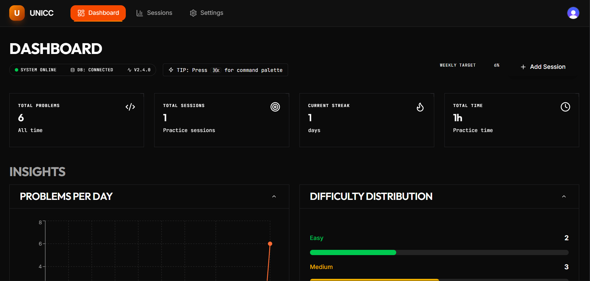
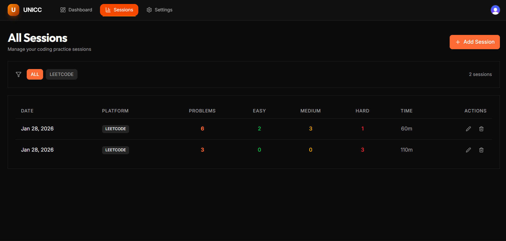

# UNICC – Developer Productivity Dashboard

A full-stack dashboard to track coding practice sessions and visualize productivity across platforms like LeetCode and Codeforces.

## ✨ What it does
- User authentication (Clerk)
- Log coding practice sessions
- Visual analytics (charts, streaks, trends)
- Responsive dark-themed dashboard

## 🛠️ Tech Stack
- **Frontend:** Next.js (App Router), TypeScript, Tailwind CSS, Recharts  
- **Backend:** Next.js API Routes, Prisma, PostgreSQL (Neon)  
- **Auth:** Clerk

## 📸 Screenshots

### Dashboard Overview


### Session Management


## 🚀 Local Setup
```bash
git clone https://github.com/Level-P1/unicc-dashboard.git
cd unicc-dashboard
npm install